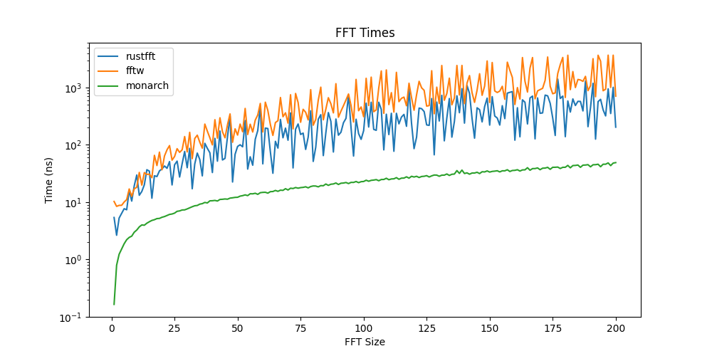

[](https://github.com/michaelciraci/Monarch-Butterfly/actions/workflows/rust.yml)
[](https://github.com/rust-secure-code/safety-dance/)
[](https://img.shields.io/crates/v/monarch-butterfly)
[](https://docs.rs/monarch-butterfly/)

# Monarch Butterfly

Experimental FFT library where all FFTs are proc-macro generated const-evaluation functions. The use case is if you know the FFT size at compile time. However, knowing the FFT size at compile time gives immense gains.

This library implements FFTs for both `f32` and `f64` sizes `1-200`. The FFTs are auto-generated so this limit could be increased above 200 at the expense of compile time.

## Features

- All functions are auto-generated with proc-macros with unrolled loops
- Zero `unsafe` code
- Completely portable
- Const-evaluation functions

## Limitations

- FFT size must be known at compile time
- By default, only FFTs up to size 200 are generated



```
use monarch_butterfly::*;
use num_complex::Complex;

let input: Vec<_> = (0..8).map(|i| Complex::new(i as f32, 0.0)).collect();
let output = fft::<8, _, _>(input);
```

This library will use all SIMD features your CPU has available including AVX512,
assuming you compile with those features (`RUSTFLAGS="-C target-cpu=native" cargo build`).

The larger the FFT sizes, the larger speed boost this library will give you.

As an example of AVX512 instructions, here is an example on just an FFT
of size 128: https://godbolt.org/z/Y58eh1x5a(`Ctrl+F` for "zmm" instructions)

The FFTs before unrolling are heavily inspired from [RustFFT](https://github.com/ejmahler/RustFFT).
Credit is given to Elliott Mahler as the RustFFT original author.
